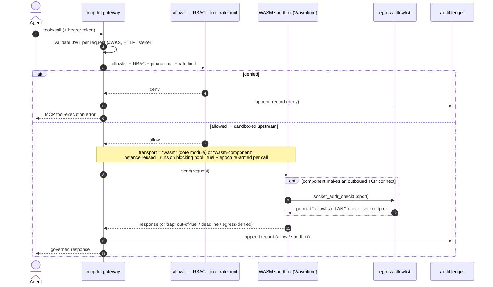

# MCPdef — MCP Gateway & Governance Plane

A fast, self-hostable, **single-binary MCP gateway & governance plane** in Rust
(shipped as a static-ish multi-arch binary — see the musl + Wasmtime build
caveat under [Install / build](#install--build)).
MCPdef sits *in the data path* between agents and **MCP (Model Context Protocol)**
servers: it multiplexes transports (stdio / legacy HTTP+SSE / Streamable HTTP),
terminates and **brokers** auth so individual servers never hold long-lived
creds, decides **allow / deny / transform** per call, can sandbox untrusted
third-party servers in **WASM (Wasmtime)**, and writes a **tamper-evident audit
ledger** of every tool call. MCP adoption raced ahead of IT governance — orgs
already run dozens of MCP servers with scattered credentials, duplicate servers
across teams, and **no audit trail of which tools agents call**. The category is
under 18 months old, the existing tools are mostly SaaS or early Python/TS, and
the open gap is the one MCPdef fills: a fast, self-hostable, single-binary MCP
gateway with strong sandboxing + audit that a security team would trust *in the
data path*.

MCPdef brings three capabilities together in one gateway: an **MCP gateway /
control plane**, a **WASM (Wasmtime) tool-sandbox runtime**, and an **MCP security
proxy** — inline injection / secret-exfil detection with MCP-wire rule packs. The
OSS engine and the paid `ee/` governance plane share one repository under a
documented open-core boundary (the licensing note is under
[Install / build](#install--build)).

## How it fits together

`mcpdef` is **one static binary you drop into the data path** between your MCP
clients and the MCP servers they call. Clients connect over stdio or Streamable
HTTP; you declare the servers to front in a single `mcpdef.toml`. Every
`tools/call` crosses the same gate pipeline — auth → allowlist → pinning →
rate-limit → injection scan — and is written to a tamper-evident audit ledger
**before** it reaches a server. Deny-by-default: a call that isn't explicitly
allowed returns a tool-error and is audited, so the model can self-correct.

```text
   YOUR CLIENTS                       mcpdef                    YOUR MCP SERVERS
   agents · IDE · CI            one binary, in the path         (you declare these)

   agent / IDE   ─┐                        ┌──────────┐    ┌─▶ stdio child process
   app / service ─┼─ stdio · Streamable ──▶│  mcpdef  │──▶─┼─▶ Streamable-HTTP server
   CI / script   ─┘   HTTP (+ bearer JWT)  │ (1 binary)│   ├─▶ legacy HTTP+SSE server
                                           └──────────┘    └─▶ untrusted .wasm (sandbox)

   ┌─ the gate pipeline, in order — one binary; each crate is one stage ──────
   │  mcpdef-transport ▸ speak stdio / Streamable HTTP / legacy SSE; bridge + resume
   │  mcpdef-auth      ▸ OAuth 2.1 resource server (JWKS) + RBAC on the HTTP listener
   │  mcpdef-policy    ▸ deny-by-default allowlist · named profiles · per-argument rules
   │  mcpdef-pin       ▸ pin each tool definition; deny + audit a rug-pull on change
   │  mcpdef-ratelimit ▸ token-bucket limits (per-tool + global) + per-call timeout
   │  mcpdef-inspect   ▸ scan tool descriptions + results for injection / secret exfil
   │  mcpdef-sandbox   ▸ run an untrusted server in-process under Wasmtime (egress-gated)
   │  mcpdef-audit     ▸ append every decision to a tamper-evident, hash-linked ledger
   │  mcpdef-core      ▸ the shared JSON-RPC 2.0 / MCP types the rest are built on
   └──────────────────────────────────────────────────────────────────────────
     allow → forwarded to the server      deny → audited MCP tool-error
```

**The boundary — the MCP tool wire only, never model traffic.** A separate LLM
gateway/router owns *model* requests (provider routing, fallback, token/spend).
`mcpdef` never sits between an agent and a model provider; it sits between an agent
and its **tool servers**, governing the tools / resources / prompts it invokes plus
the initialize/capabilities handshake. That keeps each layer's threat model crisp.

### Plug your MCP servers in

Point your client at `mcpdef` and declare each server once. Minimal example —
front a local stdio MCP server with a deny-by-default allowlist:

```toml
# mcpdef.toml
[gateway]
listen = "127.0.0.1:7878"

[[server]]
id        = "github"
transport = "stdio"
command   = ["mcp-server-github"]
tools     = ["list_issues", "get_file_contents"]   # only these are exposed
deny      = ["delete_*"]                            # deny wins over allow
```

```sh
mcpdef up   --config mcpdef.toml          # serve your clients over Streamable HTTP
mcpdef call list_issues --args '{}'       # one governed call from the CLI (audited)
mcpdef audit tail --format ocsf           # stream the tamper-evident ledger to a SIEM
```

Then point an MCP client at it — Claude Code / Cursor over stdio (`mcpdef run
--config mcpdef.toml`), or any Streamable-HTTP client at
`http://127.0.0.1:7878/mcp`. Remote **HTTP** servers and untrusted
**WASM-sandboxed** servers are declared the same way — see
[Usage / config sketch](#usage--config-sketch) for all three transports and
[docs/CONFIG.md](./docs/CONFIG.md) for every knob.

### Connectivity vs governance: MCPdef sits *behind* a tunnel, not instead of one

Vendor **private-MCP tunnels** — e.g. [OpenAI's Secure MCP
Tunnel](https://developers.openai.com/blog/connect-private-mcp-servers-to-openai-products),
a customer-run open-source client that reverse-connects (outbound HTTPS +
long-poll) so a hosted product can reach a private MCP server with no inbound
firewall hole — solve **reachability**, not governance. They answer *"how does
the product reach my server"*; MCPdef answers *"what is allowed to run, and is it
audited."* The two are orthogonal and compose: terminate the tunnel locally and
hand its JSON-RPC to MCPdef, which enforces allow/deny/transform + RBAC and writes
the tamper-evident audit record **before** the call reaches the real server.
MCPdef's edge over a vendor tunnel is exactly what a tunnel doesn't provide — a
**customer-held** tamper-evident ledger, a WASM server sandbox, and a path with
**no vendor in it**. (Reachability is the LLM-edge concern; MCPdef stays on the
tool layer.)

## Quickstart — see it working

Every command and output below is real (run from this directory; `$` lines are
the commands). The demo upstream is the `mock_mcp_server` binary that ships in
this crate for the integration tests — it exposes a harmless `echo` tool and a
`delete_repo` tool to exercise the deny path. Point the same config at any real
stdio/HTTP MCP server.

```sh
cargo build -p mcpdef --bins     # builds `mcpdef` and the demo `mock_mcp_server`

cat > quickstart.toml <<'EOF'
[gateway]
listen = "127.0.0.1:7878"
audit  = "./mcpdef-audit/audit.log"
pins   = "./mcpdef-pins.toml"

[[server]]
id        = "mock"
transport = "stdio"
command   = ["./target/debug/mock_mcp_server"]
tools     = ["echo"]
deny      = ["delete_*"]
EOF
```

Validate, inspect, and make one governed call:

```text
$ ./target/debug/mcpdef validate --config quickstart.toml
ok: quickstart.toml — 1 upstream(s), config valid

$ ./target/debug/mcpdef servers list --config quickstart.toml
ID           TRANSPORT        PROFILE    ALLOWLISTED TOOLS              DENY
mock         stdio            -          echo                           delete_*
1 server(s) governed · allowlist deny-by-default · `mcpdef run` for the live tool list

$ ./target/debug/mcpdef call echo --args '{"msg":"hi"}' --config quickstart.toml
echo: {"msg":"hi"}
```

A call the policy denies short-circuits before dispatch, returns an MCP
tool-execution error (so the model can self-correct), exits non-zero, and is
**always audited**:

```text
$ ./target/debug/mcpdef call delete_repo --args '{"name":"prod"}' --config quickstart.toml
Error: MCPdef denied: tool 'delete_repo' matches deny pattern 'delete_*' for 'mock'
```

Both calls landed in the hash-linked ledger as tamper-evident records (one JSON
line each — the full schema is in [docs/CONFIG.md](./docs/CONFIG.md#data-formats--compatibility)):

```text
$ ./target/debug/mcpdef audit tail --config quickstart.toml -n 2
{"seq":0,"ts_unix_ms":1783435273731,"agent":"agent:unknown","server":"mock","method":"tools/call","tool":"echo","decision":"allow","latency_ms":0,"prev_hash":"0000000000000000000000000000000000000000000000000000000000000000","hash":"4cafaa40309c19a5d052b0164ecff3ffaf45808af83cc8f570891f146c0088da"}
{"seq":1,"ts_unix_ms":1783435281869,"agent":"agent:unknown","server":"mock","method":"tools/call","tool":"delete_repo","decision":"deny","rule":"deny-glob","latency_ms":0,"prev_hash":"4cafaa40309c19a5d052b0164ecff3ffaf45808af83cc8f570891f146c0088da","hash":"f4bb388a0ba59cef9af31b5732c5f03c4dfb27d24e68fc078abafbe1a40fa17a"}
```

The chain is verifiable offline — any edit or deletion of an *interior* record
breaks every `hash` downstream. (Detecting tail-truncation or whole-file
replacement additionally requires checking against a `(head, count)` sealed
out-of-band — `mcpdef audit verify --head <h> --count <n>`; the local `verify`
proves internal consistency only. Procedure in
[docs/OPERATIONS.md](./docs/OPERATIONS.md#audit-ledger-verification).)

```text
$ ./target/debug/mcpdef audit verify --config quickstart.toml
chain OK · 2 record(s) · head=f4bb388a0ba59cef9af31b5732c5f03c4dfb27d24e68fc078abafbe1a40fa17a
```

Finally, serve it to MCP clients over Streamable HTTP (`mcpdef up` =
`run --http`; loopback-bound, Origin-validated):

```text
$ ./target/debug/mcpdef up --config quickstart.toml
mcpdef 0.1.0 ready · 1 upstream(s) · audit ./mcpdef-audit/audit.log · listening streamable-http 127.0.0.1:7878

$ curl -s -X POST http://127.0.0.1:7878/mcp \
    -d '{"jsonrpc":"2.0","id":1,"method":"tools/list"}'
{"jsonrpc":"2.0","id":1,"result":{"tools":[{"description":"echo arguments back","inputSchema":{"type":"object"},"name":"echo"}]}}
```

`tools/list` shows only the allowlisted surface (`delete_repo` is hidden), and
SIEM export streams from the same ledger:
`mcpdef audit tail --format ocsf | your-siem-forwarder` (also `cef`/`syslog`/`json`).

Safety and audit are **never paywalled**: the complete data path — transport
bridging, allowlists, the tamper-evident ledger, token brokering, RBAC, policy
enforcement, and the WASM sandbox — ships in the free OSS binary.

### Event flow: a governed `tools/call` (with the WASM sandbox)

Every call crosses the same governance pipeline before it reaches an upstream;
the **in-path Wasmtime sandbox** is just one kind of upstream behind that seam, so
the same allowlist/RBAC/policy/pin/audit gates apply to it. The sequence below
traces a `tools/call` to a sandboxed server through that governance pipeline.



The **core-module** path (`transport = "wasm"`) runs against an empty linker — zero
ambient capability, so the `opt` egress step never applies. The **component** path
(`transport = "wasm-component"`) adds capability-scoped WASI whose only grant is
outbound TCP, and that is what the egress allowlist gates (default deny-all). The
Phase-3 policy-as-code engine and inline injection scan (result-content scanning /
redaction) slot into the governance step when they land; today's shipped gates
are the ones shown.

## Install / build

The OSS engine crates live at the repository root (Apache-2.0); the paid
governance plane lives under `ee/` (Business Source License 1.1, its own
workspace, never packaged into the public crates). BSL 1.1 permits customers to
self-host the paid plane inside their own VPC and auto-converts to Apache-2.0
after the Change Date. Build the binary `mcpdef`:

```sh
cargo build -p mcpdef --release            # target/release/mcpdef
cp mcpdef.example.toml mcpdef.toml         # then edit upstreams/policy before running
cargo run   -p mcpdef -- run --config mcpdef.toml
cargo run   -p mcpdef -- servers list
```

The single binary fronts every agent action, so low latency and low memory are
product requirements, not nice-to-haves — that is why it is Rust + Tokio + the
official `rmcp` SDK, and why the **Wasmtime** sandbox (Rust's strongest area) is
in-binary rather than a SaaS add-on. Because Wasmtime's Cranelift backend embeds
a JIT, the fully-static `*-linux-musl` build has to be validated against that
backend (the JIT path may fall back to glibc/distroless) — hence "static-ish,"
not a blanket fully-static promise. A fully-static, no-JIT profile (the Pulley
interpreter) is available for locked-down hosts that forbid W^X pages.

## Usage / config sketch

MCPdef runs with one config file declaring the servers it fronts. Allowlists are
the fast, declarative first gate (tools today; resource-URI allowlists are
parsed but reserved); the Phase-3 policy engine will do the richer
per-agent/per-arg logic. Every knob is documented in
[docs/CONFIG.md](./docs/CONFIG.md); a full commented example is
[`mcpdef.example.toml`](./mcpdef.example.toml).

```toml
# mcpdef.toml
[gateway]
listen = "127.0.0.1:7878"          # Streamable HTTP listener, Origin-validated, localhost-bound
audit  = "./mcpdef-audit/audit.log"  # hash-linked ledger (JSONL)
pins   = "./mcpdef-pins.toml"        # tool-def pinning + rug-pull detection

[[server]]
id        = "github"
transport = "stdio"
command   = ["mcp-server-github"]
tools     = ["list_issues", "get_file_contents"]   # only these tools exposed
deny      = ["delete_*"]                            # glob deny; deny wins over allow

[[server]]
id        = "internal-db"
transport = "streamable-http"
url       = "https://mcp.internal/mcp"              # egress/SSRF-guarded, DNS-pinned

[[server]]
id        = "scraper"
transport = "wasm-component"       # untrusted server as a wasm32-wasip2 component, run in Wasmtime
wasm      = "./servers/scraper.component.wasm"
wasm_allow_egress = ["10.0.0.7:8443"]               # outbound TCP allowlist (ip:port; deny-all otherwise)
```

```sh
mcpdef run  --config mcpdef.toml                     # serve the client over stdio (mcpdef up = run --http)
mcpdef call list_issues --args '{}'                # one-shot governed tool call (audited)
mcpdef audit verify                                # offline chain check (--head/--count: verify against a seal)
mcpdef audit tail --format ocsf                    # SIEM export (also cef/syslog/json)
mcpdef pin && mcpdef diff-tools                      # approve tool definitions / detect rug-pulls
```

## Documentation

| Doc | What's in it |
|---|---|
| [README.md](./README.md) | This file — overview, the gap, a verified quickstart session + audit record, install, the boundary note. |
| [docs/CONFIG.md](./docs/CONFIG.md) | **Reference.** Every knob: `mcpdef.toml` keys (gateway, auth, rate limits, egress, roles, profiles, servers/sandbox), CLI flags, on-disk data formats (ledger, pin store). |
| [docs/API.md](./docs/API.md) | **Reference.** The wire surface as built: HTTP listener endpoints + status codes, the MCP method dispatch, the `tools/call` gate order and every deny rule/error a client can see. |
| [docs/OPERATIONS.md](./docs/OPERATIONS.md) | **Runbook.** Deploy, what state to back up, the audit-ledger verification procedure (incl. out-of-band seals), monitoring, symptom-first troubleshooting, security posture. |
| [docs/DOCKERHUB.md](./docs/DOCKERHUB.md) | The published container image — tags, a quick `docker run`, and where MCPdef fits in a stack. |

Repo-level docs:

- [CONTRIBUTING.md](./CONTRIBUTING.md) — how to build, test, and submit changes (DCO sign-off).
- [SECURITY.md](./SECURITY.md) — private, embargoed vulnerability disclosure.
- [CODE_OF_CONDUCT.md](./CODE_OF_CONDUCT.md) — community expectations.
- [RELEASING.md](./RELEASING.md) — how releases are cut, signed (cosign/SBOM/SLSA), and verified.
- [CHANGELOG.md](./CHANGELOG.md) — release history and MCP spec-revision support.
- [`mcpdef.example.toml`](./mcpdef.example.toml) — a fully-commented reference config.

The crate layout is in the table below.

## Status

**Phase 1 + Phase 1.5 — landed; in progress.** The Phase-0 design doc set is
complete, and the gateway ships as a working Cargo workspace under
[`crates/`](./crates):

| Crate | Role |
|---|---|
| [`mcpdef`](./crates/mcpdef) | the single binary — config, the gateway proxy loop, the downstream **Streamable HTTP listener** (`run --http` / `up`, with **OAuth 2.1** termination + **RBAC**), CLI (`run`/`up`/`call`/`validate`/`version`/`servers list`/`audit verify`/`audit tail`/`egress show`/`pin`/`diff-tools`) |
| [`mcpdef-core`](./crates/mcpdef-core) | the normalized JSON-RPC 2.0 envelope + MCP method/decision types |
| [`mcpdef-transport`](./crates/mcpdef-transport) | the `Transport` trait + stdio child (with **token-broker env injection**), **Streamable HTTP + legacy HTTP+SSE bridge**, and the **egress/SSRF guard** (metadata block + DNS pinning) |
| [`mcpdef-sandbox`](./crates/mcpdef-sandbox) | the **in-path WASM sandbox** — run an untrusted MCP server under **Wasmtime** behind the same `Transport` seam, with **fuel** (CPU) + **memory** caps and an **optional wall-clock deadline** (epoch). Two paths: a **core module** against an **empty linker** (zero ambient capability — no fs/net/clock), or a **`wasm32-wasip2` component** (the `mcpdef:server` WIT world) under **capability-scoped WASI** whose only grant is outbound TCP, gated by a **per-destination egress allowlist** (default deny-all; reuses the egress IP classification) |
| [`mcpdef-policy`](./crates/mcpdef-policy) | the deny-by-default tool allowlist (**glob allow/deny + reusable named profiles**), the **RBAC** role→grant model, and the **policy-as-code** rule engine — per-agent / per-argument allow/deny (`[[policy]]`) layered over the allowlist |
| [`mcpdef-auth`](./crates/mcpdef-auth) | the **OAuth 2.1 Resource Server** — per-request bearer JWT validation against a JWKS (asymmetric-only, algorithm-confusion-safe), RFC 8707/9068 audience, RFC 9728 Protected Resource Metadata + `WWW-Authenticate` challenge |
| [`mcpdef-pin`](./crates/mcpdef-pin) | **tool-def pinning + rug-pull detection** — canonical tool-def hashing + a persistent pin store |
| [`mcpdef-ratelimit`](./crates/mcpdef-ratelimit) | **token-bucket rate limiting** (per-tool + global) for the `tools/call` hot path |
| [`mcpdef-inspect`](./crates/mcpdef-inspect) | **inline injection / secret-exfil scanning** — a rule pack over tool descriptions (at connect) + tool-call results (per call), with off/warn/enforce modes |
| [`mcpdef-audit`](./crates/mcpdef-audit) | the append-only, hash-linked, tamper-evident ledger + offline `verify` + OCSF/CEF/syslog SIEM export |

What works today: a transport-multiplexing reverse proxy that fronts upstream MCP
servers over **stdio**, **Streamable HTTP**, or the **legacy 2024-11-05 HTTP+SSE
bridge** — including the dual-transport **probe/fallback** (try Streamable HTTP,
fall back to legacy on a 400/404/405) and **`Last-Event-ID` resumption**. It runs
the initialize/`tools/list` handshake, aggregates and allowlist-filters
`tools/list`, enforces the allowlist on `tools/call` (deny-by-default; a denial
returns a tool-execution error and is **audited**), and appends every governed
call to the hash-linked ledger. HTTP upstreams pass through an **egress/SSRF
guard** (cloud-metadata always blocked, private/loopback configurable, HTTPS for
public hosts, DNS-pinned). Allowlists support **globs and named profiles**, and a
gateway can be scoped to an **active profile** (`mcpdef run --profile readonly`) to
cut the tool surface an agent sees. With `[gateway] pins` set, MCPdef **pins each
tool's definition** and denies + audits a `rug-pull` if a server changes it after
approval (`mcpdef pin` / `mcpdef diff-tools`). It defends its own availability with
**token-bucket rate limiting** (per-tool + global → a `rate-limited` audit) and a
**per-call upstream timeout** (a wedged upstream is failed as `upstream-timeout`,
not left to hang). Clients reach mcpdef over **stdio** or the **downstream
Streamable HTTP listener** (`mcpdef run --http`) — `Origin`-validated (cross-site →
`403`), loopback-bound, with an opt-in in-flight load-shedding cap. That listener
can **terminate OAuth 2.1**: with `[gateway.auth]` set, every request must carry a
valid bearer JWT (validated per request as an OAuth 2.1 **Resource Server** —
signature against the JWKS, `aud`/`iss`/`exp`, asymmetric-only), a
missing/invalid token gets `401` + a `WWW-Authenticate` challenge pointing at the
**RFC 9728 Protected Resource Metadata** document, and the token's subject becomes
the audit identity. **RBAC** roles (`[[role]]`, keyed on the token's scopes/roles)
layer over the allowlist, and a stdio upstream's brokered credential is injected
via **`[server.env]`** so a client's bearer is never passed through. An upstream
can also be an **untrusted MCP server run in-path under Wasmtime** — MCPdef executes
it itself, no child process — with each call bounded by a **fuel** budget (CPU), a
**linear-memory ceiling**, and an **optional wall-clock deadline** (`wasm_deadline_ms`,
via epoch interruption). A core module (`transport = "wasm"`) runs against an
**empty linker** (no filesystem, network, or clock; a module importing WASI fails
to load). A **`wasm32-wasip2` component** (`transport = "wasm-component"`, the
`mcpdef:server` WIT world) runs under **capability-scoped WASI** that grants nothing
by default; its only possible host capability is outbound TCP, gated by a
**per-destination egress allowlist** (`wasm_allow_egress`, default deny-all,
reusing the egress IP classification so cloud-metadata/special-use is always
blocked). The same governance (allowlist, RBAC, audit) applies to either as to any
other upstream. The tamper-evident ledger is reachable and SIEM-exportable from
the CLI (`mcpdef audit verify` / `mcpdef audit tail --format ocsf`). For demos and scripts, **`mcpdef up`** is
shorthand for `run --http` and **`mcpdef call <tool>`** invokes a single tool through
the governance path (allowlist/profiles/pinning/rate-limit + audit; RBAC gates
authenticated HTTP callers, not this local CLI) and prints the result. Driven by one
[`mcpdef.toml`](./mcpdef.example.toml). Built against MCP spec **2025-11-25** while
forward-planning the stateless **2026-07-28** RC.

```sh
cargo run -p mcpdef -- validate --config mcpdef.example.toml
cargo run -p mcpdef -- up --config mcpdef.example.toml          # bring it up over Streamable HTTP (= run --http)
cargo run -p mcpdef -- call list_issues --args '{}' --config mcpdef.example.toml  # one-shot governed tool call
cargo run -p mcpdef -- audit verify    # offline hash-chain check
cargo test            # 152 tests: unit + stdio/HTTP-bridge + egress + pin + rate-limit + listener + OAuth/RBAC (+ JWKS rotation) + wasm-sandbox (module + component) + injection/secret-exfil scan + CLI
```

**Next:** a `transform` policy effect (argument/result mutation) on the
**policy-as-code** engine that shipped this cycle (per-agent / per-argument
allow/deny, Phase 3).
Phase 4 has now landed — the in-path **Wasmtime sandbox**: an untrusted MCP server
run behind the gateway with fuel + memory + epoch caps, as either a zero-capability
**core module** (`transport = "wasm"`) or a **`wasm32-wasip2` component**
(`transport = "wasm-component"`) under capability-scoped WASI with a per-destination
**egress allowlist**. It joins Phase 2 (OAuth 2.1 termination + token broker +
RBAC on the HTTP listener) and the egress/SSRF guard that shipped early. The
category is fresh and **crowding fast** — highest reward, highest competition
velocity — so the build sequence front-loads the differentiators (in-path WASM
sandbox + tamper-evident audit) that the SaaS/early-Python incumbents can't match.
